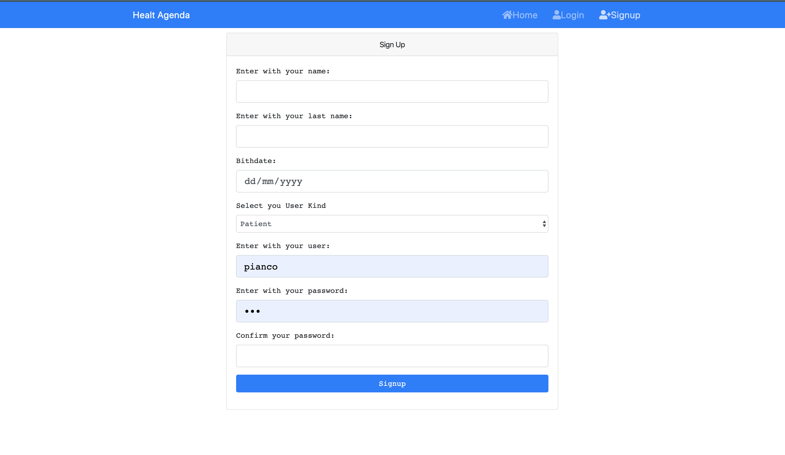

# HealthAgenda

Project using in a developer selection to reactJS the goal was to show the ability to develop simple components in reactJS and use redux.

## Technologies

-   1. ReactJS
-   2. Redux
-   3. NodeJS
-   4. Docker

### To Run

Clone this repository in your local or virtual machine and run the script bellow

`yarn start`

Runs the app in the development mode. 
Open [http://localhost:3000](http://localhost:3000) to view it in the browser.

### Or using Docker

In the Terminal: `docker build -t h/agenda . && docker run --rm -d -p 3000:3000/tcp h/agenda:latest`

Using docker-compose: `run: docker-compose up -d`

## Components

### Home Component

### Signin Component

### Signup Component

### Signin Component

### Not Found Page

## Things to do

-   1. Refactor redux structure(duck pattern)
-   2. Change style base
-   3. Increase documentation
-   4. Connect with rest api (https://github.com/MarcusPianco/health-agenda-api)
-   5. Refactor JSX components
-   6. Change to styled components
